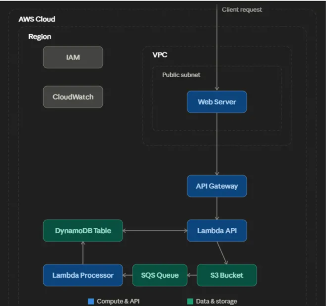
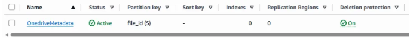
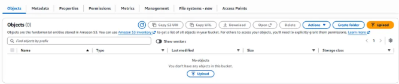
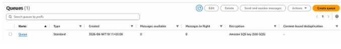
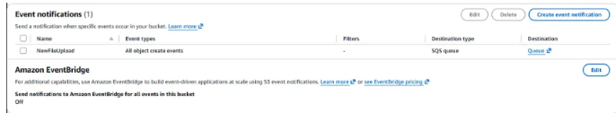
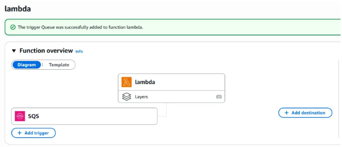
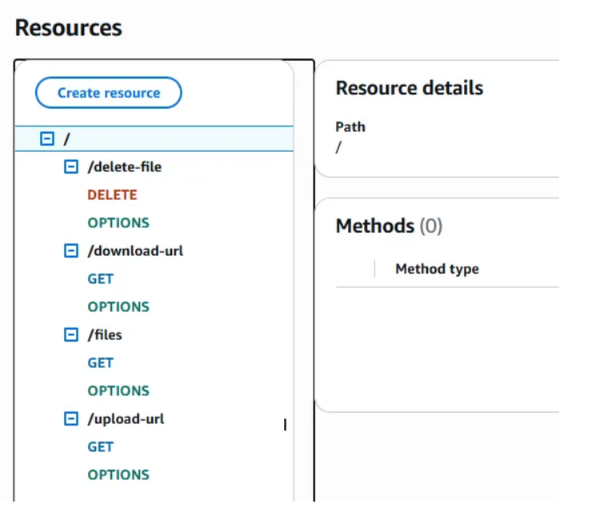
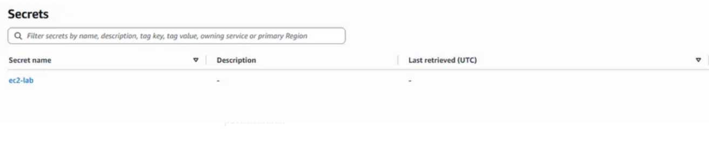
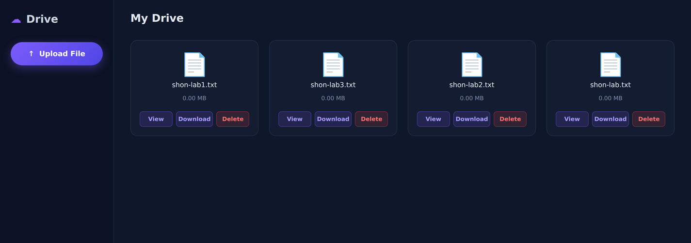

# Secure Cloud Drive on AWS

A secure, private cloud-based file management system (similar to OneDrive), built entirely on AWS managed services. Users get scalable file storage, controlled access, and automated backend processing through a lightweight web interface.

The project integrates **Amazon S3, DynamoDB, Lambda, API Gateway, and SQS**, with an **Amazon EC2** instance hosting a small **Python Flask** web app for file management. The design focuses on **security, least-privilege access control, encryption, scalability, and event-driven communication** between AWS services.

---

## Architecture



**Request flow:**

```
Client  ->  EC2 (Flask web app)  ->  API Gateway  ->  Lambda (API)  ->  S3 / DynamoDB
                                                                          |
                                    S3 upload event  ->  SQS  ->  Lambda (Processor)  ->  DynamoDB
```

- The **web app on EC2** receives user actions and forwards them to **API Gateway**.
- The **API Lambda** issues pre-signed S3 URLs, lists files, and deletes files.
- When a file lands in **S3**, an **event notification** publishes a message to **SQS**.
- The **Processor Lambda** consumes the SQS message and writes the file's metadata to **DynamoDB**.

---

## AWS services used

| Service | Role in the project |
|---|---|
| **IAM** | Two least-privilege roles (EC2 + Lambda) and resource-based policies |
| **DynamoDB** | `OneDriveMetadata` table — the file index (id, status, size) |
| **KMS** | Customer Managed Key (CMK) for SSE-KMS encryption of S3 and SQS |
| **S3** | Private, versioned, encrypted bucket for file storage |
| **SQS** | Buffers S3 upload events for asynchronous processing |
| **Lambda** | API handler (pre-signed URLs / list / delete) + metadata processor |
| **API Gateway** | REST API with API key, usage plan, throttling and quotas |
| **Secrets Manager** | Stores the API URL/key the EC2 app reads at runtime |
| **EC2** | Hosts the Flask web interface; locked down by security group + IAM role |

> **Note:** ARNs in this repo use the placeholder account ID `123456789012` and lab resource names. Replace them with your own before deploying.

---

## Security highlights

- **Least privilege everywhere** — each role can touch only the exact services and resources it needs.
- **Encryption at rest** — S3 and SQS use SSE-KMS with a Customer Managed Key.
- **No hard-coded credentials** — EC2 uses an IAM role and reads secrets from AWS Secrets Manager at runtime.
- **Private storage** — the S3 bucket blocks public access and has versioning enabled.
- **Scoped resource policies** — the SQS queue only accepts messages from the specific S3 bucket; the KMS key policy grants only the operations each principal requires.
- **Network restriction** — the EC2 security group allows access only from a specific IP.

---

## Implementation

### 1. Identity and Access Management (IAM)

The project uses two IAM roles following the least-privilege principle:

- `iam_role_lambda` — for the Lambda functions, with limited access to S3, DynamoDB, SQS, CloudWatch Logs and KMS.
- `iam_role_ec2` — for the EC2 web server, so the app runs without storing AWS credentials.

**EC2 inline policy** ([`iam/ec2-inline-policy.json`](iam/ec2-inline-policy.json)) — an inline policy is used because there is a single EC2 instance. It grants specific API Gateway invoke permission and `secretsmanager:GetSecretValue` so the instance can retrieve its secret. The trust policy allows only the EC2 service to assume the role.

```json
{
    "Version": "2012-10-17",
    "Statement": [
        {
            "Effect": "Allow",
            "Action": "execute-api:Invoke",
            "Resource": "arn:aws:execute-api:us-east-1:123456789012:abcde12345/lab/*/*"
        },
        {
            "Effect": "Allow",
            "Action": "secretsmanager:GetSecretValue",
            "Resource": "arn:aws:secretsmanager:us-east-1:123456789012:secret:ec2-lab*"
        }
    ]
}
```

**Lambda inline policy** ([`iam/lambda-inline-policy.json`](iam/lambda-inline-policy.json)) — least-privilege access to S3, DynamoDB, SQS, CloudWatch Logs and KMS. The trust policy allows only the Lambda service to assume the role.

```json
{
    "Version": "2012-10-17",
    "Statement": [
        { "Sid": "S3Access", "Effect": "Allow",
          "Action": ["s3:PutObject", "s3:GetObject", "s3:DeleteObject"],
          "Resource": "arn:aws:s3:::lab-shon/*" },
        { "Sid": "DynamoDBAccess", "Effect": "Allow",
          "Action": ["dynamodb:PutItem", "dynamodb:GetItem", "dynamodb:UpdateItem", "dynamodb:DeleteItem", "dynamodb:Scan"],
          "Resource": "arn:aws:dynamodb:us-east-1:123456789012:table/OneDriveMetadata" },
        { "Sid": "SQSAccess", "Effect": "Allow",
          "Action": ["sqs:ReceiveMessage", "sqs:DeleteMessage", "sqs:GetQueueAttributes"],
          "Resource": "arn:aws:sqs:us-east-1:123456789012:Queue" },
        { "Sid": "LambdaLogs", "Effect": "Allow",
          "Action": ["logs:CreateLogGroup", "logs:CreateLogStream", "logs:PutLogEvents"],
          "Resource": "arn:aws:logs:us-east-1:123456789012:*" },
        { "Sid": "KMSAccess", "Effect": "Allow",
          "Action": ["kms:Decrypt", "kms:Encrypt", "kms:GenerateDataKey", "kms:DescribeKey"],
          "Resource": "arn:aws:kms:us-east-1:123456789012:key/key-lab" }
    ]
}
```

### 2. Amazon DynamoDB

A DynamoDB table named **`OneDriveMetadata`** stores file metadata — file ID, status and size — acting as the index for the files stored in S3. Encryption at rest uses a Customer Managed KMS Key for tighter control over key management, permissions and auditing, and **deletion protection** is enabled to prevent accidental data loss.



### 3. AWS Key Management Service (KMS)

Server-Side Encryption with a KMS Customer Managed Key (SSE-KMS) protects the S3 bucket and SQS messages. The key policy ([`policies/kms-key-policy.json`](policies/kms-key-policy.json)) follows least privilege: key administration only for authorized administrators, encrypt/decrypt only for the Lambda role, and message-encryption permissions for the SQS service.

```json
{
  "Id": "key-1",
  "Version": "2012-10-17",
  "Statement": [
    { "Sid": "Enable IAM User Permissions", "Effect": "Allow",
      "Principal": { "AWS": "arn:aws:iam::123456789012:root" },
      "Action": "kms:*", "Resource": "*" },
    { "Sid": "Allow access for Key Administrators", "Effect": "Allow",
      "Principal": { "AWS": "arn:aws:iam::123456789012:user/lab-user" },
      "Action": ["kms:Create*","kms:Describe*","kms:Enable*","kms:List*","kms:Put*","kms:Update*","kms:Revoke*","kms:Disable*","kms:Get*","kms:TagResource","kms:UntagResource","kms:RotateKeyOnDemand"],
      "Resource": "*" },
    { "Sid": "Allow use of the key", "Effect": "Allow",
      "Principal": { "AWS": "arn:aws:iam::123456789012:role/lambda-lab" },
      "Action": ["kms:Encrypt","kms:Decrypt","kms:GenerateDataKey*","kms:DescribeKey"],
      "Resource": "*" },
    { "Sid": "Allow SQS Service to use the key", "Effect": "Allow",
      "Principal": { "Service": "sqs.amazonaws.com" },
      "Action": ["kms:Decrypt","kms:GenerateDataKey*"],
      "Resource": "*" }
  ]
}
```

### 4. Amazon S3

A **private** S3 bucket (`lab-shon`) with Server-Side Encryption (SSE-KMS, CMK) and **bucket versioning** enabled to retain and protect previous versions of objects. Public access is blocked and encryption at rest is enforced.



### 5. Amazon SQS

An SQS queue encrypted with the Customer Managed KMS Key, so messages are encrypted at rest. The queue policy ([`policies/sqs-queue-policy.json`](policies/sqs-queue-policy.json)) allows only the specific S3 bucket to send messages.

```json
{
  "Version": "2012-10-17",
  "Statement": [{
    "Effect": "Allow",
    "Principal": { "Service": "s3.amazonaws.com" },
    "Action": "sqs:SendMessage",
    "Resource": "arn:aws:sqs:us-east-1:123456789012:Queue",
    "Condition": {
      "ArnLike": { "aws:SourceArn": "arn:aws:s3:::lab-shon" }
    }
  }]
}
```



An **S3 Event Notification** links the bucket to the SQS queue, so every new object upload is sent to the queue for processing.



### 6. Lambda

**Metadata processor** ([`lambda/metadata_processor.py`](lambda/metadata_processor.py)) — triggered by SQS. It processes the messages generated by S3 upload events, extracts the file's key and size, and stores them in the DynamoDB table for indexing.

```python
import boto3
import json

dynamodb = boto3.resource('dynamodb')
table = dynamodb.Table('OneDriveMetadata')


def lambda_handler(event, context):
    for record in event['Records']:
        body = json.loads(record['body'])
        if 'Records' in body:
            s3_data = body['Records'][0]['s3']
            file_key = s3_data['object']['key']
            size = s3_data['object']['size']

            table.put_item(Item={
                'file_id': file_key,
                'status': 'Available',
                'size_bytes': size
            })
    return {'statusCode': 200}
```



**API handler** ([`lambda/api_handler.py`](lambda/api_handler.py)) — integrated with API Gateway. It generates pre-signed S3 upload/download URLs, lists files from DynamoDB, and deletes files from both S3 and DynamoDB.

```python
import boto3
import json
import urllib.parse
from botocore.config import Config
from decimal import Decimal

BUCKET = "lab-shon"

s3 = boto3.client('s3', config=Config(signature_version='s3v4'))
dynamodb = boto3.resource('dynamodb')
table = dynamodb.Table('OneDriveMetadata')

CORS = {"Access-Control-Allow-Origin": "*"}


class DecimalEncoder(json.JSONEncoder):
    def default(self, obj):
        if isinstance(obj, Decimal):
            return int(obj) if obj % 1 == 0 else float(obj)
        return super(DecimalEncoder, self).default(obj)


def lambda_handler(event, context):
    path = event.get('path', '')

    if path == '/upload-url':
        file_name = event['queryStringParameters']['filename']
        url = s3.generate_presigned_url(
            ClientMethod='put_object',
            Params={'Bucket': BUCKET, 'Key': file_name},
            ExpiresIn=3600
        )
        return {"statusCode": 200, "headers": CORS,
                "body": json.dumps({"upload_url": url, "key": file_name})}

    if path == '/download-url':
        db_file_name = event['queryStringParameters']['filename']
        s3_key = urllib.parse.unquote_plus(db_file_name)
        url = s3.generate_presigned_url(
            ClientMethod='get_object',
            Params={'Bucket': BUCKET, 'Key': s3_key},
            ExpiresIn=3600
        )
        return {"statusCode": 200, "headers": CORS,
                "body": json.dumps({"download_url": url})}

    if path == '/delete-file':
        db_file_name = event['queryStringParameters']['filename']
        s3_key = urllib.parse.unquote_plus(db_file_name)
        s3.delete_object(Bucket=BUCKET, Key=s3_key)
        table.delete_item(Key={'file_id': db_file_name})
        return {"statusCode": 200, "headers": CORS,
                "body": json.dumps({"status": "deleted"})}

    if path == '/files':
        response = table.scan()
        return {"statusCode": 200, "headers": CORS,
                "body": json.dumps(response.get('Items', []), cls=DecimalEncoder)}

    return {"statusCode": 404, "headers": CORS,
            "body": json.dumps({"error": "Not found"})}
```

### 7. API Gateway

A REST API (`LabGateway`) exposes four endpoints — `/upload-url`, `/download-url`, `/files` and `/delete-file` — each with its `OPTIONS` method for CORS. The API is deployed with an **API key**, a **usage plan**, and **throttling and quota limits** to control access.



### 8. AWS Secrets Manager

A Secrets Manager secret (`ec2-lab`) holds the API URL and API key. The EC2 app reads these at runtime instead of embedding them in the application code.



### 9. Amazon EC2 (Flask web app)

An EC2 instance hosts the web application ([`ec2/app.py`](ec2/app.py)) that receives user requests and forwards them to API Gateway. Sensitive values live in Secrets Manager, the security group allows access only from a specific IP, and the instance uses the least-privilege IAM role. Uploads are proxied server-side so the API key never reaches the browser.



---

## Result

The system was deployed successfully and all services work together as designed. File **upload, view, download and delete** were tested end-to-end and behave correctly. The full event-driven flow — S3 upload → SQS → Lambda → DynamoDB — is fully integrated and functioning.

---

## Repository layout

```
AWS-project/
├── README.md
├── images/                     # architecture + AWS console screenshots
├── lambda/
│   ├── metadata_processor.py   # SQS-triggered: writes metadata to DynamoDB
│   └── api_handler.py          # API Gateway: pre-signed URLs, list, delete
├── ec2/
│   └── app.py                  # Flask web interface
├── iam/
│   ├── ec2-inline-policy.json
│   └── lambda-inline-policy.json
└── policies/
    ├── kms-key-policy.json
    └── sqs-queue-policy.json
```
